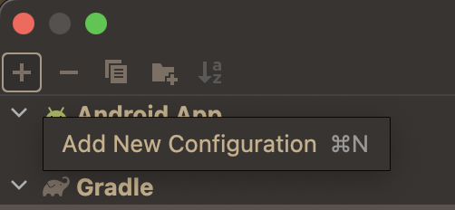
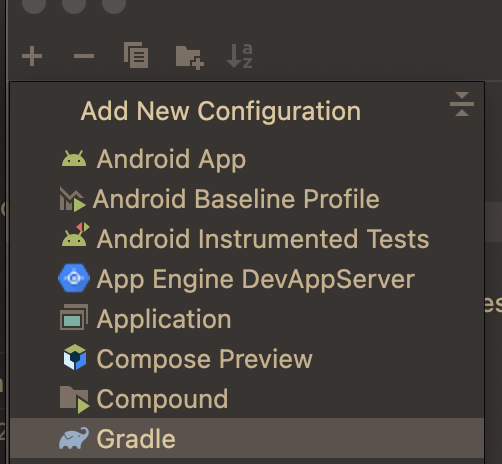
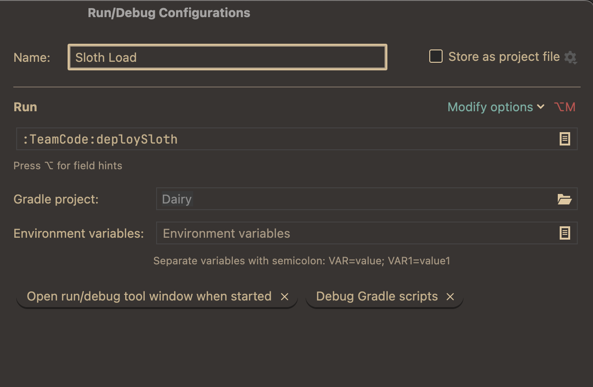
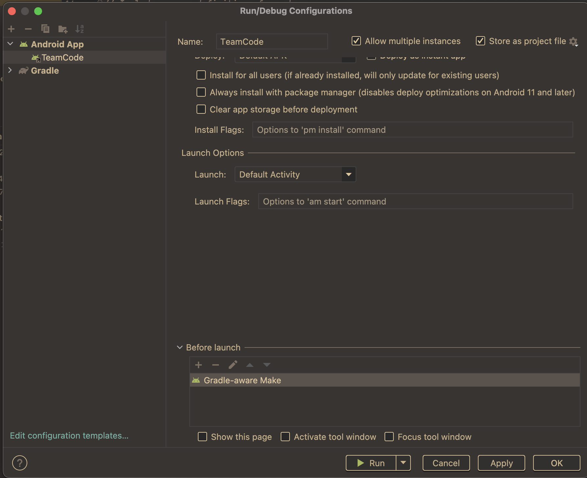
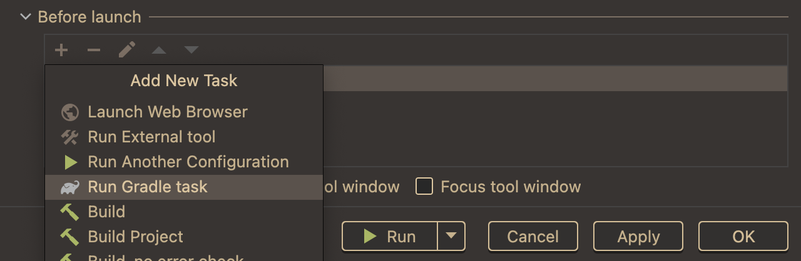
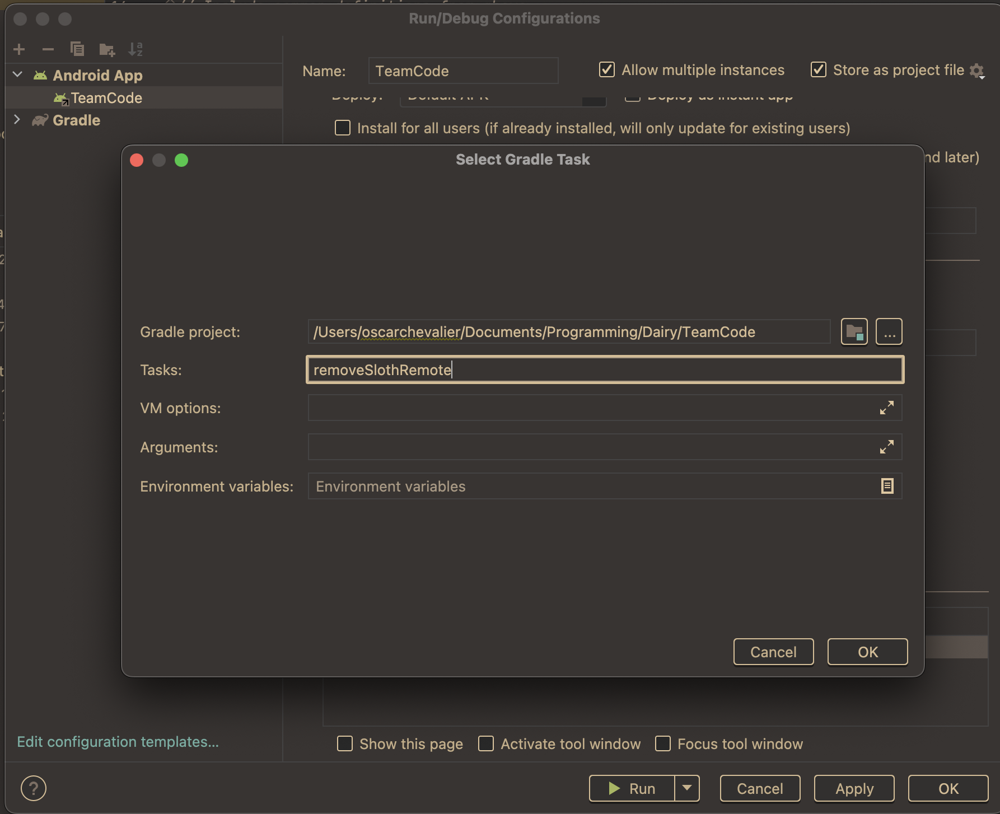
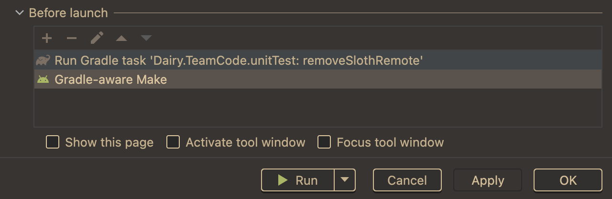

<a href="https://repo.dairy.foundation/#/releases/dev/frozenmilk/Sinister" target="_blank">

</a>

This is a candidate for 2.0 of sinister.

Check out docs [here](https://docs.dairy.foundation/Sinister/overview)

Version 2.0.0 of Sinister bundles 1.0.3 of Util.

Sinister is built as part of the [Dairy
monorepo](https://github.com/Dairy-Foundation/Dairy)

You can install this from the Dairy snapshots maven repository, which is
documented on the docs website.

To install it, either install
[Pride](https://repo.dairy.foundation/#/snapshots/dev/frozenmilk/sinister/Pride)
or [Sloth](https://repo.dairy.foundation/#/snapshots/dev/frozenmilk/sinister/Sloth)

Pride acts like the old Sinister runtime

Sloth allows sideloading (like fastload)
differences from fastload:
1. loads from the loaded folder defaultly, you delete it when you upload (don't
   worry, its automated)
2. `@NoUnload` can be put on classes to only load them from the apk, adding or
   removing this annotation to a class and then Sloth loading it is undefined
   behaviour
3. listens to file system events rather than for a gradle notification (this
   seems to speed things up)
4. built on new Sinister, so supports dynamic class path scanning and unloading,
   including OpMode registration, (so supports Dairy)
5. Has a fix patch for Dash
6. Not hacked onto the OnBotJava system, so doesn't break that

If you install Sloth you also need to install the Sloth Load gradle plugin:

1.
add this to the top of your `TeamCode` `build.gradle`
```gradle
buildscript {
    repositories {
        mavenCentral()
        maven {
            url "https://repo.dairy.foundation/snapshots"
        }
    }
    dependencies {
        classpath "dev.frozenmilk.sinister.sloth:Load:0.0.0"
    }
}
```

2.
add this after the apply lines in the same file
```gradle
// there should be 3 more lines that start with apply here
apply plugin: 'dev.frozenmilk.sinister.sloth.Load'
```

3.
sync and download onto your robot via standard install

4.
add the gradle tasks:

   1. edit configurations:

   

   2. add new configuration:

   

   3. select gradle:

   

   4. add `deploySloth` and save it:

   

   5. edit TeamCode configuration:

   

   6. add new gradle task:

   

   7. add `removeSlothRemote`:

   

   note: type `:TeamCode` into the `Gradle Project` box to get the right contents,
   do not copy mine.

   8. put `removeSlothRemote` first and save:

   

5. Give it a try!

Run the deploySloth task you just added to deploy the code.
